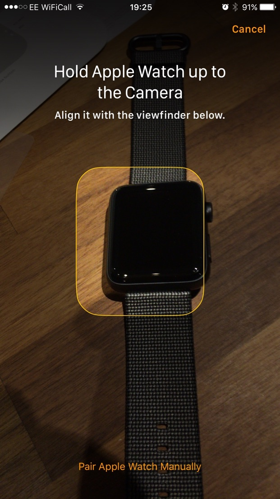

25/09/2016

I'm now a proud owner of a **Apple Watch Series 2** and thought I would share my initial feelings over this piece of kit.

Before I go any further, let me clarify that I don't believe a smart watch is in anyway a must have device in the way a mobile or even tablet is. It is a luxury piece of tech that compliments what your mobile can do. If you expect it to be a digital zeitgeist like your first smartphone was, you will be sorely disappointed.

And again, before i carry on: if you were procrastinating between the 42mm or 38mm versions, go for the 42mm. Its not that big, even on my skinny wrists and the 38mm one is so small its pretty useless.

I decided to purchase an Apple Watch mainly as a replacement for my current Garmin forerunner 405 and as a bog standard telling the time Watch that looked good. As an Apple fanbois, no other watch was in the running, but I had managed to ignore the original watch as poor battery life and no GPS were major issues. I’ve also always believed the first iteration of any Apple product should be avoided, theres always design flaws and issues which need ironed out.

So the major changes in the Series 2 watch:

* Faster processers
* Waterproof
* GPS

## Setup
All pairing is done from the Watch app on your iPhone, open the app and then turn on your watch. The watch displays a particle effect like shape which you then point the iPhone camera at and it does its magic, similar to a QR Code I assume.

Thats about it, some questions about what wrist your going to wear it and your up and running.

The actual interface isn’t too easy to get to grips with, it doesn’t have the same intuitive feel to it of an iPhone, then again phones UI’s are part and parcel of our lives and taken for granted now. Still until you get to grips with it, trying to navigate around can be a bit frustrating.

* The main screen is obviously the clock, hard pressing lets you choose different faces and customise these.
* Pressing the digital crown (the wind up bit) takes you to the old style app screen
* Pressing the button takes you to the Dock, where you can place your fave apps.

Rather than trying to change settings etc on the watch, I found it much easier to do these from the iPhone app. If your the pottering type, there are lots of settings to play around with here. All app installations and music syncs are done from here also.

## Initial Thoughts
My first thought on completing the setup was this was a lovely sleek piece of kit, ok what do I do now? And to be honest, there isn’t anything to do! There isn’t actually much to do within the watch, it really is all about complimenting your already existing activities and actions.

So even though I was aware of this, I couldn’t help feeling slightly deflated. There is only so often you can check what time it is before it becomes boring.

The haptic feedback did keep me occupied for a bit, it truly is a weird pleasure. It feels like someone is tapping your skin.

## Watch Apps
That was a few days ago and I’ve now started to mould the watch into my daily grind. As with all pieces of hardware, its the software that really makes or breaks it, which in this case is the apps. I have been surprised by how useful some of these have been, and also how useless some of the more highly anticipated ones are.

**Messages** - This mainly just serves the purpose of notifying you of messages, actually having to use it to write up the witty retorts your friends are used to may be a step too far. You can setup commonly used replies in the iPhone app, or use simple emojis so for short generic replies it works fine. It must also be said, the ability to handwrite replies which are turned into text works really well.

**Fantastical 2** - Haven’t used the native calendar app as Fantastical is my fave, it works exactly as you would expect

**Evernote** - Hmm, every time I try and search, it crashes. So for now thats useless, mind you, I’m not sure how useful that information is on a watch screen to begin with.

**1Password** - The only question I can ask is why? why would i need passwords on my watch? theres nothing I can do with these passwords...

**Breathe** - Simple idea, notify me a few times a day to stop and take some deep breaths. Its really simple and calming, the haptic feedback is pretty cool.

**Strava** - Initially kept crashing then it worked. hmm its not a native app, so you still need your iPhone close by. In my case, this is useless, lets hope a native app is in the pipeline.

**Workout** - Didn’t have high hopes for this, but due to Strava being crap, this became the main activity app for me. Its does what it says, so no complaints.

**Activity** - I can imagine becoming addicted to this app, it measures 3 activity types (move, stand, exercise) and measures them daily in a spiral graph. Achievements forthcoming for the activity swots.

**Music** - It plays music, either from your iPhone or music synced onto the watch (default 1Gb storage, can be upped to 2Gb in the settings). Works a treat!

## Watch performance and battery life
I’ve used the native workout app for a 14 mile run (around 2 hours), which for 2 miles I also listened to music through bluetooth headphones. this took up 40% of the battery, which all things considered isn’t too bad as GPS is a killer on any device. From my few days test window I’m finishing a day with around 40% battery left.

I haven’t tried to swim with it yet, so no comments on that. GPS seems to be decent, haven’t seen any crazy zig zags routes across a map yet. Heart rate monitor seems ok, its not as accurate as my Garmin chest strap, but its serviceable.

## Wrap up
So after a few days use and initial disappointment, I’ve started to learn how to use the Apple Watch in a way that benefits my daily routine. Again, with the risk of repeating myself, this is not a must have device. Its not the best sports watch out there for hardcore sports folks, but it is adequate for everyday use. It doesn’t do anything amazing, but will subtly changed how you deal with you’re everyday digital information flow. An expensive non essential, yes, but isn’t it lovely looking...